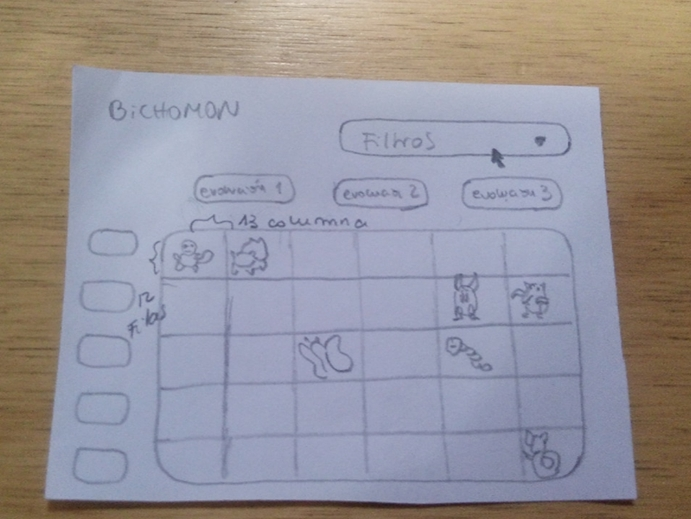
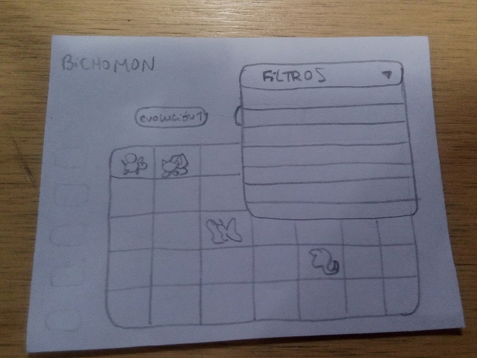
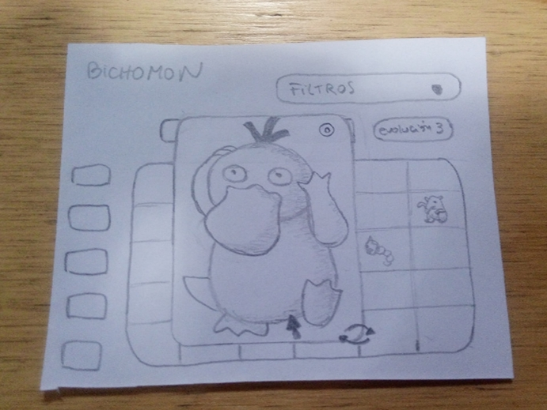
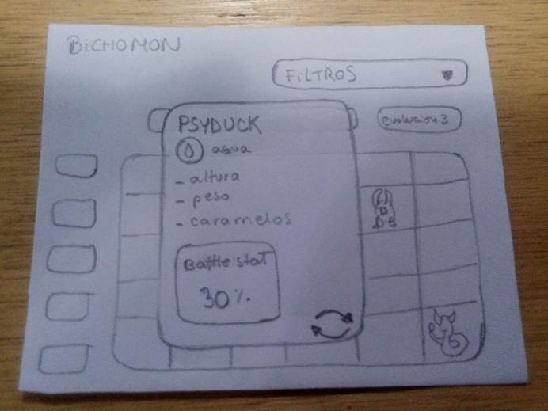
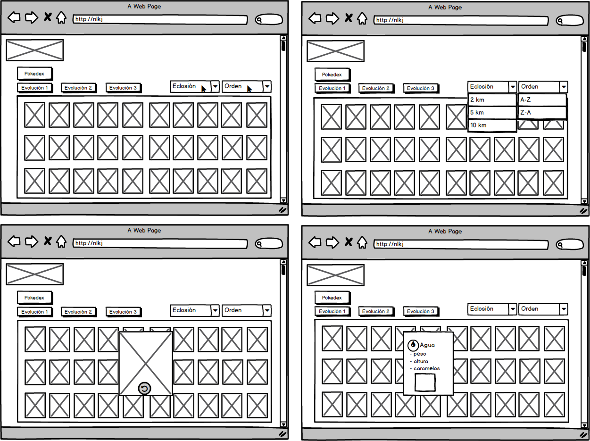
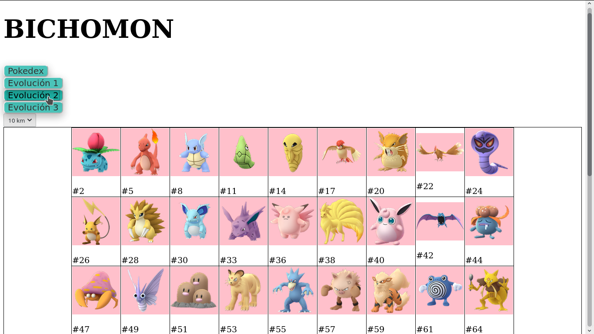
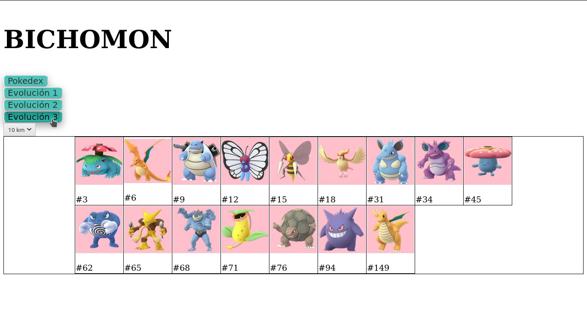
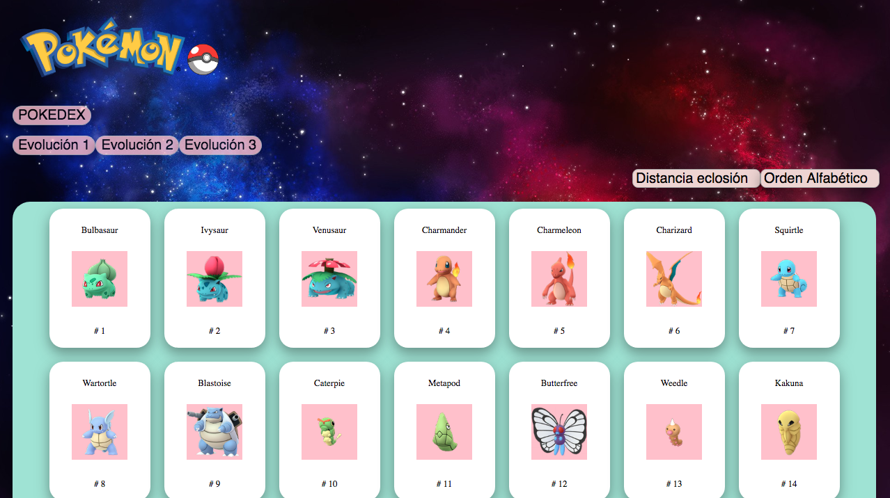
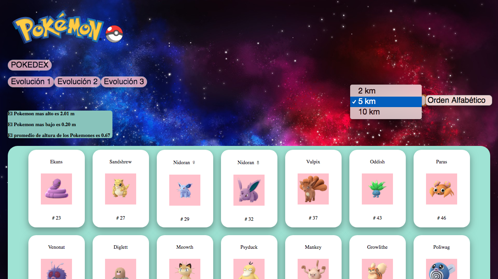
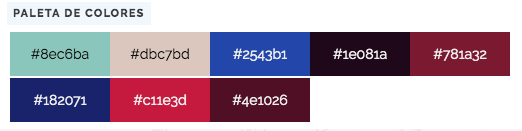

# **Data Lovers**

# Bichomon

Esta aplicación web fue creada pensando en los jugadores amateurs de pokemon, ya que el juego es algo reciente y el fénomeno pokemon fue algo que estalló hace ya varios años, nos dimos cuenta a través de encuestas entre un publico general de **POKEMON GO** que son muchos los jugadores jóvenes, en edades entre los 12 y 16, que se han sumado recientemente a la tendencia y que nunca vieron la serie, por lo tanto no manejan tanto conocimiento sobre los pokemons y sus características generales y básicas, algo que los deja en desventeja frente a otros jugadores más experimentados, además de ser un obstaculo a la hora de socializar entre las redes de jugadores. Notamos mucho interés por lo tanto, en una app que pudiese brindarles esos datos de forma rápida, practica y llamativa. 

___

## Primer sketch de la aplicación web

___

## Test de Usabilidad 1

Este es un test de usabilidad general, la idea es aplicarlo con el formato sketch de nuestro prototipo, los aspectos que tratará nuestra prueba son los siguientes:

- Contenido
- Navegación

### Objetivo

Esta es una prueba temprana en el proceso de desarrollo de la aplicación web, la diseñamos para detectar de forma sencilla y rápida, posibles fallas de usabilidad en el diseño y la navegación, y poder replantear la aplicación de ser necesario, sin incurrir en tanto trabajo, como aún es un prototipo de baja fidelidad, será un testeo rápido que solo se enfocara en los contenidos generales de las interacciones que ofrecen los botones y filtros y la navegación general del sitio web.

#### Preguntas sobre Contenido

Estas preguntas se harán antes de tener interacción con la app y luego de tenerla, estan enfocadas a descubrir si el usuario objetivo de nuestra aplicación logra identificar claramente el contenido de la página, el contenido que ofrece y que nos de feedback sobre su valoración de este contenido.

#### Preguntas sobre Navegación

Estas preguntas estan enfocadas en reunir información sobre la experiencia de nuestro usuario objetivo respecto a la navegación y usabilidad de nuestra aplicación web. Si bien la pregunta 1 de Contenido y la 1 de éste ítem, apuntan ambas a los botones, la primera busca saber si el contenido que ofrece es de interés para el usuario y la pregunta 1 del ítem de Navegación pretende indagar sobre si se explica bien lo que el botón hace.

___

**Prueba de usabilidad**

Entrevistador: 
Fecha:
Sitio Web: 

**NOTA para la aplicación prueba:** 
- Entregar todas las instrucciones de forma simple y repetitiva. 
- Mantener una actitud paciente con el usuario, evitando “caras” de impaciencia, enojo, preocupación o cualquier gesto que haga sentir mal o presionado al usuario 
- Anotar todo lo posible 
- Aparte de las instrucciones necesarias para completar la prueba, no se deben entregar pistas al usuario de lo que tiene que hacer cuando interactúe con el prototipo de la aplicación web. 

**Presentación del usuario**
1. ¿Cuál es tu nombre?, ¿Que edad tienes?
2. ¿Hace cuanto juegas **POKEMON GO**?
3. ¿En que nivel considerarías que estas si pudieras escoger entre principiante, medio o experimentado?

#### Preguntas sobre Contenido
*estas preguntas se realizaran luego de que el usuario observe la pantalla inicial y antes de que interactue con el prototipo de la app*

1. ¿Cual crees que es el objetivo del sitio web luego de darle un primer vistazo?
2. ¿Que opinas del contenido que te ofrecen los botones de la aplicación?, ¿Lo consideras relevante para ti como jugador?

#### Preguntas sobre Navegación
*estas preguntas se deben realizar luego de que el usuario ya navegó a través de la página, a su ritmo, sin intervenciones del entrevistador*

1. ¿La información que te ofrecen los textos de los botones tiene concordancia con las funciones que estos ejecutan?
2. ¿lograste entender fácilmente como acceder a las interacciones que te proponía la página?
3. ¿Que podrías decirnos respecto a tu experiencia navegando a través de la página?

___

## Prueba aplicada

**Prueba de usabilidad/Usuario 1**

Entrevistador: Nicoleth Lara/ Trinidad Dominguez
Fecha: 2 de Julio, 2019
Sitio Web: Bichomon

**NOTA para la aplicación prueba:** 
- Entregar todas las instrucciones de forma simple y repetitiva. 
- Mantener una actitud paciente con el usuario, evitando “caras” de impaciencia, enojo, preocupación o cualquier gesto que haga sentir mal o presionado al usuario 
- Anotar todo lo posible 
- Aparte de las instrucciones necesarias para completar la prueba, no se deben entregar pistas al usuario de lo que tiene que hacer cuando interactúe con el prototipo de la aplicación web. 

**Presentación del usuario**
1. ¿Cuál es tu nombre?, ¿Que edad tienes?
  Alonso Hermosilla, 17 años.
2. ¿Hace cuanto juegas **POKEMON GO**?
  *Comencé a jugar recién hace cuatro meses, porque un amigo me convenció.*
3. ¿En que nivel considerarías que estas si pudieras escoger entre principiante, medio o experimentado?
  *Principiante definitivamente.*

#### Preguntas sobre Contenido
*estas preguntas se realizaran luego de que el usuario observe la pantalla inicial y antes de que interactue con el prototipo de la app*

1. ¿Cual crees que es el objetivo del sitio web luego de darle un primer vistazo?
  *Creo que es como una guía pokemon*
2. ¿Que opinas del contenido que te ofrecen los botones de la aplicación?, ¿Lo consideras relevante para ti como jugador?
  *Me gusta mucho poder ver las evoluciones, porque es algo que aun no tengo claro, pero la verdad el peso y la altura no se usan cuando estas jugando pokemon go, así que creo que esta un poco de más.*

#### Preguntas sobre Navegación
*estas preguntas se deben realizar luego de que el usuario ya navegó a través de la página, a su ritmo, sin intervenciones del entrevistador*

1. ¿La información que te ofrecen los textos de los botones tiene concordancia con las funciones que estos ejecutan?
 *Si, si, creo que los botones estaban super claros.*
2. ¿lograste entender fácilmente como acceder a las interacciones que te proponía la página?
  *Si, tuve muy claro como llegar a lo que quería, aunque no vi ningún botón de volver atrás, pero creo tal vez no era necesario.*
3. ¿Que podrías decirnos respecto a tu experiencia navegando a través de la página?
  *Creo que igual como es un prototipo sencillo, la navegación se hace sencilla.*

___

**Prueba de usabilidad/Usuario 2**

Entrevistador: Trinidad Dominguez/ Nicoleth Lara
Fecha: 2 de julio, 2019
Sitio Web: 

**NOTA para la aplicación prueba:** 
- Entregar todas las instrucciones de forma simple y repetitiva. 
- Mantener una actitud paciente con el usuario, evitando “caras” de impaciencia, enojo, preocupación o cualquier gesto que haga sentir mal o presionado al usuario 
- Anotar todo lo posible 
- Aparte de las instrucciones necesarias para completar la prueba, no se deben entregar pistas al usuario de lo que tiene que hacer cuando interactúe con el prototipo de la aplicación web. 

**Presentación del usuario**
1. ¿Cuál es tu nombre?, ¿Que edad tienes?
  Andrea Moncada, 28 años
2. ¿Hace cuanto juegas **POKEMON GO**?
  *Llevo jugando en total unos 3 años, pero igual entre medio tuve un período largo sin jugar y recién ahora lo estoy haciendo de forma más constante, así que aún soy principiante.*
3. ¿En que nivel considerarías que estas si pudieras escoger entre principiante, medio o experimentado?
  *principiante.* (respondió a esto en la pregunta anterior)

#### Preguntas sobre Contenido
*estas preguntas se realizaran luego de que el usuario observe la pantalla inicial y antes de que interactue con el prototipo de la app*

1. ¿Cual crees que es el objetivo del sitio web luego de darle un primer vistazo?
  *Creo que el objetivo podría ser como una especie de wikipedia de pokemon para jugadores de pokemon go, aunque me parece que igual para jugadores más principiantes porque la info es más "básica".*
2. ¿Que opinas del contenido que te ofrecen los botones de la aplicación?, ¿Lo consideras relevante para ti como jugador?
  *Si, creo que las instrucciones son muy especifícas, no tuve drama con eso.*

#### Preguntas sobre Navegación
*estas preguntas se deben realizar luego de que el usuario ya navegó a través de la página, a su ritmo, sin intervenciones del entrevistador*

1. ¿La información que te ofrecen los textos de los botones tiene concordancia con las funciones que estos ejecutan?
  *son super obvios, si.*
2. ¿lograste entender fácilmente como acceder a las interacciones que te proponía la página?
  *no tuve problem con eso.*
3. ¿Que podrías decirnos respecto a tu experiencia navegando a través de la página?
  *como es una página sencilla, no hay mucho que pueda complicarse al navegar a través de ella.*
___

**Prueba de usabilidad/Usuario 3**

Entrevistador: Nicoleth Lara/ Trinidad Dominguez
Fecha: 2 de julio, 2019
Sitio Web: 

**NOTA para la aplicación prueba:** 
- Entregar todas las instrucciones de forma simple y repetitiva. 
- Mantener una actitud paciente con el usuario, evitando “caras” de impaciencia, enojo, preocupación o cualquier gesto que haga sentir mal o presionado al usuario 
- Anotar todo lo posible 
- Aparte de las instrucciones necesarias para completar la prueba, no se deben entregar pistas al usuario de lo que tiene que hacer cuando interactúe con el prototipo de la aplicación web. 

**Presentación del usuario**
1. ¿Cuál es tu nombre?, ¿Que edad tienes?
  Josefa Haure, 22 años
2. ¿Hace cuanto juegas **POKEMON GO**?
  *Estoy jugando pokemon hace literalmente como dos semanas, lo instalé porque mi pololo lo jugaba, para poder jugar con el.*
3. ¿En que nivel considerarías que estas si pudieras escoger entre principiante, medio o experimentado?
  *Estoy en nivel cero yo creo, la verdad aun tengo muy pocos pokemones y no entiendo del todo la dinámica del juego.*

#### Preguntas sobre Contenido
*estas preguntas se realizaran luego de que el usuario observe la pantalla inicial y antes de que interactue con el prototipo de la app*

1. ¿Cual crees que es el objetivo del sitio web luego de darle un primer vistazo?
  *Creo que es como una página de burla a las páginas que dan info de pokemon, por el título, suena muy chistoso, como irónico.*
2. ¿Que opinas del contenido que te ofrecen los botones de la aplicación?, ¿Lo consideras relevante para ti como jugador?
  *si, osea el tema de las evoluciones es más de nivel básico, así que si esta enfocada en amateurs creo que esta bien planteado.*

#### Preguntas sobre Navegación
*estas preguntas se deben realizar luego de que el usuario ya navegó a través de la página, a su ritmo, sin intervenciones del entrevistador*

1. ¿La información que te ofrecen los textos de los botones tiene concordancia con las funciones que estos ejecutan?
  *si.*
2. ¿lograste entender fácilmente como acceder a las interacciones que te proponía la página?
  *¿A los botones de evolucion? si, dice literalmente "evolución" así que difícil perderse.*
3. ¿Que podrías decirnos respecto a tu experiencia navegando a través de la página?
  *Me confunde un poco que creo que tmb hay botones al costado además de arriba.*

___

**Prueba de usabilidad/Usuario 4**

Entrevistador: Trinidad Dominguez/ Nicoleth Lara
Fecha: 2 de julio, 2019
Sitio Web: Bichomon

**NOTA para la aplicación prueba:** 
- Entregar todas las instrucciones de forma simple y repetitiva. 
- Mantener una actitud paciente con el usuario, evitando “caras” de impaciencia, enojo, preocupación o cualquier gesto que haga sentir mal o presionado al usuario 
- Anotar todo lo posible 
- Aparte de las instrucciones necesarias para completar la prueba, no se deben entregar pistas al usuario de lo que tiene que hacer cuando interactúe con el prototipo de la aplicación web. 

**Presentación del usuario**
1. ¿Cuál es tu nombre?, ¿Que edad tienes?
  Cristian Spinola, 32 años.
2. ¿Hace cuanto juegas **POKEMON GO**?
  *Empecé a jugar cuando recién sacaron la app y era mucho más básica, así que me aburrió un poco, y después volví hace poco a jugar, porque quería probar las actualizaciones.*
3. ¿En que nivel considerarías que estas si pudieras escoger entre principiante, medio o experimentado?
  *Diría que estoy en un nivel medio.*

#### Preguntas sobre Contenido
*estas preguntas se realizaran luego de que el usuario observe la pantalla inicial y antes de que interactue con el prototipo de la app*

1. ¿Cual crees que es el objetivo del sitio web luego de darle un primer vistazo?
  *Me parece igual que es como informativo, pero no sé, también podría ser como un foro creo, por el nombre, que es como más informal por decirlo así.*
2. ¿Que opinas del contenido que te ofrecen los botones de la aplicación?, ¿Lo consideras relevante para ti como jugador?
  *Osea si, igual las evoluciones siempre van a ser relevantes porque a uno se le puede olvidar.*

#### Preguntas sobre Navegación
*estas preguntas se deben realizar luego de que el usuario ya navegó a través de la página, a su ritmo, sin intervenciones del entrevistador*

1. ¿La información que te ofrecen los textos de los botones tiene concordancia con las funciones que estos ejecutan?
  *Si, osea dicen evolución y ahí cuando pincho me muestra la evolución, así que si.*
2. ¿lograste entender fácilmente como acceder a las interacciones que te proponía la página?
  *Creo que si, osea ¿te refieres a los botones? si es así si, aunque igual están como medios muy "esparcidos" por la página.*
3. ¿Que podrías decirnos respecto a tu experiencia navegando a través de la página?
  *En general es super clara.*
___

**Prueba de usabilidad/Usuario 5**

Entrevistador: Nicoleth Lara/ Trinidad Dominguez
Fecha: 2 de julio, 2019
Sitio Web: Bichomon

**NOTA para la aplicación prueba:** 
- Entregar todas las instrucciones de forma simple y repetitiva. 
- Mantener una actitud paciente con el usuario, evitando “caras” de impaciencia, enojo, preocupación o cualquier gesto que haga sentir mal o presionado al usuario 
- Anotar todo lo posible 
- Aparte de las instrucciones necesarias para completar la prueba, no se deben entregar pistas al usuario de lo que tiene que hacer cuando interactúe con el prototipo de la aplicación web. 

**Presentación del usuario**
1. ¿Cuál es tu nombre?, ¿Que edad tienes?
  Francisca Guerrero, 15 años.
2. ¿Hace cuanto juegas **POKEMON GO**?
  *Estoy jugando hace dos años, pero no tengo mucho tiempo, así que tampoco juego todo el rato, cuando tengo tiempo los fines de semana no más, y no siempre salgo, entonces no todos los fines de semana.*
3. ¿En que nivel considerarías que estas si pudieras escoger entre principiante, medio o experimentado?
  *Medio, por el tiempo que llevo jugando sobre todo, porque tampoco tengo nada muy bacán.*

#### Preguntas sobre Contenido
*estas preguntas se realizaran luego de que el usuario observe la pantalla inicial y antes de que interactue con el prototipo de la app*

1. ¿Cual crees que es el objetivo del sitio web luego de darle un primer vistazo?
  *Es como para ver información de pokemon creo.*
2. ¿Que opinas del contenido que te ofrecen los botones de la aplicación?, ¿Lo consideras relevante para ti como jugador?
  *Si y estan muy lindos.*

#### Preguntas sobre Navegación
*estas preguntas se deben realizar luego de que el usuario ya navegó a través de la página, a su ritmo, sin intervenciones del entrevistador*

1. ¿La información que te ofrecen los textos de los botones tiene concordancia con las funciones que estos ejecutan?
   *Si, son concordantes.* 
2. ¿lograste entender fácilmente como acceder a las interacciones que te proponía la página?
  *Si, súper, hay páginas muy difíciles, pero creo que también porque tienen más cosas.*
3. ¿Que podrías decirnos respecto a tu experiencia navegando a través de la página?
  *En el prototipo se ve muy fácil y que no necesito pensar tanto.*
___

## Conclusiones

Si bien no son tantas las interacciones que los usuarios podían realizar con la aplicación web, ya que es un primer prototipo básico, la aplicación de este test sí nos sirvió para detectar de forma temprana algunas fallas a nivel macro. Uno de los primeros cambios que decidimos en base a los resultados del test, es cambiar el nombre de la aplicación, ya que varios usuarios al ver el nombre de la aplicación ("Bichomon") pensaron que la aplicación podía ser una especie de burla a otras páginas que también entregan información sobre data pokemon, esto por tener un tono demasiado casual. Algunos usuarios también manifestaron que les era confusa la forma en que los botones estaban dispuestos, es decir, tanto en la parte superior como en el costado izquierdo (como se puede apreciar en las imágenes adjuntadas más arriba en el apartado "Primer sketch de la aplicación web") por lo que decidimos manejar los botones en una franja horizontal arriba de la sección "Pokedex".

___

## Nuevo protitpo

___

## Segunda Iteración

___

## Test de Usabilidad 2

El test de usabilidad se enfocará en los aspectos que consideramos como más relevantes para obtener una visión integral de la funcionalidad de nuestra aplicación web, estos aspectos son los siguientes:
    
 - Identidad 
 - Contenido 
 - Navegación 
 - Gráfica Web 
 - Utilidad 
 
 ### Objetivo
 Nuestro objetivo con esta prueba es recoger información general y específica que nos permita tener una idea clara de la percepción del usuario respecto a la funcionalidad y contenido de nuestra aplicación web. Para lograr esto de una mejor manera a continuación explicaremos las preguntas de cada sección y que información buscamos recopilar de cada una

 #### Preguntas sobre Identidad
 
Las preguntas de esta sección buscan establecer si nuestra aplicación web se distingue de otras del mismo tipo, para ver si de esta forma el usuario logra hacerse alguna imagen de marca de la institución propietaria de la aplicación. Para lograr esto las preguntas se harán previo a tener alguna interacción con el sitio web, además de solo mirar a primera vista la pantalla inicial, y así ver cuál es su impresión a priori.

Para esto las preguntas 1, 2 y 5 estan enfocadas en saber si el usuario identifica alguna corporación o marca a la que pueda relacionar nuestra aplicación web al igual que un público objetivo, las preguntas 3 y 4 estan dirigidas a saber si los elemntos de la página ayudan a llegar a este objetivo

#### Preguntas sobre Contenido

Como esta indicado en la prueba de usabilidad, estas preguntas se deben realizar una vez que ya se haya permitido al usuario navegar a través de la aplicación web.

El objetivo de esta sección de preguntas es saber cual es la percepción del usuario acerca de la calidad de los contenidos. Con la pregunta 1 se busca establecer si el contenido mostrado es relevante para el usuario y con las preguntas 2 y 3 se busca establecer si la forma en que estos contenidos se muestran ayuda a entender la información.

#### Preguntas sobre Navegación

Esta sección busca descubrir si la forma en la que se presenta y organiza la información la información dentro de la aplicación web guarda relación con nuestro publico objetivo (edad, expertiz dentro del juego, intereses).

Para esto las preguntas 1, 2 y 3 apuntan a saber si el usuario pudo navegar sin dificultad a través de las distintas interacciones que ofrece el sitio y regresar al punto de partida si asi lo deseara y no perderse en el intento.

#### Preguntas sobre Gráfica Web

Con estas preguntas buscamos conocer si la información gráfica de la aplicación es de ayuda, si es armónica a la vista, así como su percepción sobre la velocidad de despliegue de esta.

#### Preguntas sobre Utilidad

Estas son las preguntas finales de la prueba y apuntan a obtener una visión general de la experiencia del usuario con nuestra aplicación web

Para esto la pregunta 1 y 2 apuntan a obtener información general sobre la relevancia de lo presentado en la  pagina y la utilidad de esta para el usuario dentro de su contexto específico. la pregunta 3 busca recoger un resumen de la experiencia del usuario.

___

**Prueba de Usabilidad**

Entrevistador: 
Fecha:
Sitio Web: 

**NOTA para la aplicación prueba:** 
- Entregar todas las instrucciones de forma simple y repetitiva. 
- Mantener una actitud paciente con el usuario, evitando “caras” de impaciencia, enojo, preocupación o cualquier gesto que haga sentir mal o presionado al usuario 
- Anotar todo lo posible 
- Aparte de las instrucciones necesarias para completar la prueba, no se deben entregar pistas al usuario de lo que tiene que hacer cuando navegue el sitio web. 

 <Nombre usuario>, agradecemos tu disposición de participar en esta “Prueba de Usabilidad”  que nos ayudará a detectar problemas en el sitio que desarrollamos.  Es importante que sepas que ésta prueba solo busca medir la usabilidad de nuestro sitio y no tu desempeño en el. Vamos a comenzar con algunas preguntas que nos permitirán saber quién eres y cómo utilizas Internet. 

#### Presentación del Usuario
1. ¿Cual es su nombre? 
2. ¿A qué se dedica [Profesión, Actividad]? 
3. ¿Qué experiencia tienes como jugador de Pokemon Go? 
4. ¿Juegas habitualmente?, ¿Cuantas horas juegas al día, a la semana? 
5. ¿Sueles visitar sitios con contenido sobre el juego?, ¿Que información buscas en ellos?

  Queremos  comentarte  antes  de  comenzar  con  las  preguntas  sobre  el  sitio  mismo, que es probable que no puedas completar todas las acciones requeridas, ya que es una aplicación web en desarrollo, si esto ocurre, quiere decir que necesitamos perfeccionar ciertos detalles, por lo tanto tu ayuda y feedback es muy importante para nosotras.   La   prueba   tiene   una   duración   máxima   de   30   minutos   aproximadamente. Te pedimos que  durante  las  acciones  que  desarrolles,  vayas manifestando  en  voz  alta  lo  que  estes  pensando  con  el  fin  de  que  podamos  entender  qué  te  sugiere la interacción con  cada  pantalla.  Las preguntas que surjan en la navegación sólo las podremos responder al final de la prueba, esto para no influenciar los resultados.

#### Identidad
*estas preguntas se realizaran luego de que el usuario observe la pantalla inicial y antes de que interactue con cualquier función de la página*

1. ¿Con la información entregada en la pantalla, puedes identificar con que marca o corporación se relaciona la aplicación web? ¿Como lo sabes?
2. ¿Viste algún elemento gráfico que te ayudara a llegar a esta conclusión?
3. ¿Relacionas los colores predominantes del sitio web con la marca?
4. ¿Dintingues alguna imagen que identifique la marca, crees que esta información aparece en un lugar importante de la página?
5. ¿Hacia que tipo de audiencia crees que esta dirigida la aplicación web y porque?

#### Contenido
*estas preguntas se deben realizar luego de que el usuario ya navegó a través de la página, a su ritmo, sin intervenciones del entrevistador*

1. ¿Te parecen relevantes los contenidos que te ofrecen los botones al inicio de la pantalla?¿Si no es así, cuáles te interesarían?
2. ¿Pudiste distinguir con una primera mirada el contenido más importante de la página? ¿cómo lo identificaste?
3. ¿Los textos usados tanto en la página en general como en los botones son lo suficientemente descriptivos de lo que ofrecen al interactuar con ellos?

#### Navegación

1. ¿Lograste entender fácilmente la forma en que se navega por el sitio?
2. ¿Te queda claro cómo volver atrás o como poder escoger otro filtro?
3. ¿La información que te ofrece la pantalla es clara en cuanto a en qué lugar del sitio estas o te sentiste perdido dentro del sitio?

#### Gráfica Web

1. ¿Te parece adecuada la forma en la que se presentan las imágenes dentro del sitio web?, ¿represetan el contenido del sitio?
2. ¿Sentiste que las imágenes se demoraban en cargar o que el sitio era muy lento?
3. ¿Consideras que gráficamente el sitio esta equilibrado, recargado o muy simple?

#### Utilidad

1. ¿Tras la primera mirada, te queda claro el objetivo del sitio y los contenidos que ofrece?, ¿Podrías mencionarlos?
2. ¿Crees que estos contenido y servicios son de utilidad para ti?
3. ¿Que te llamó la atención positiva o negativamente de la utilidad del sitio web?
___

### Aplicación Test de Usabilidad

**Prueba de Usabilidad/Usuario 1**

Entrevistador: Trinidad Dominguez/ Nicoleth Lara
Fecha: 8 de julio, 2019.
Sitio Web: Pokemon

**NOTA para la aplicación prueba:** 
- Entregar todas las instrucciones de forma simple y repetitiva. 
- Mantener una actitud paciente con el usuario, evitando “caras” de impaciencia, enojo, preocupación o cualquier gesto que haga sentir mal o presionado al usuario 
- Anotar todo lo posible 
- Aparte de las instrucciones necesarias para completar la prueba, no se deben entregar pistas al usuario de lo que tiene que hacer cuando navegue el sitio web. 

 <Nombre usuario>, agradecemos tu disposición de participar en esta “Prueba de Usabilidad”  que nos ayudará a detectar problemas en el sitio que desarrollamos.  Es importante que sepas que ésta prueba solo busca medir la usabilidad de nuestro sitio y no tu desempeño en el. Vamos a comenzar con algunas preguntas que nos permitirán saber quién eres y cómo utilizas Internet. 

#### Presentación del Usuario
1. ¿Cual es su nombre? 
  Luciano Mancilla, 18 años.
2. ¿A qué se dedica [Profesión, Actividad]? 
  Estudiante de Ingeniera civil en construcción.
3. ¿Qué experiencia tienes como jugador de Pokemon Go? 
  *Estoy jugando pokemon go hace más de un año, juego de f orma super esporádica si, cuando tengo que caminar a alguna parte.*
4. ¿Juegas habitualmente?, ¿Cuantas horas juegas al día, a la semana? 
  *Si tuviera que dar un aproximado de tiempo tipo en promedio, diría que una vez a la semana, aunque en verdad no soy tan consistente, pero digamos que una vez a la semana por unas 3 hrs en total.*
5. ¿Sueles visitar sitios con contenido sobre el juego?, ¿Que información buscas en ellos?
  *Si, igual los veo seguido, para recordar información que no tengo aprendida de memoria y que la verdad tampoco quiero aprenderme de memoria.*

  Queremos  comentarte  antes  de  comenzar  con  las  preguntas  sobre  el  sitio  mismo, que es probable que no puedas completar todas las acciones requeridas, ya que es una aplicación web en desarrollo, si esto ocurre, quiere decir que necesitamos perfeccionar ciertos detalles, por lo tanto tu ayuda y feedback es muy importante para nosotras.   La   prueba   tiene   una   duración   máxima   de   30   minutos   aproximadamente. Te pedimos que  durante  las  acciones  que  desarrolles,  vayas manifestando  en  voz  alta  lo  que  estes  pensando  con  el  fin  de  que  podamos  entender  qué  te  sugiere la interacción con  cada  pantalla.  Las preguntas que surjan en la navegación sólo las podremos responder al final de la prueba, esto para no influenciar los resultados.

#### Identidad
*estas preguntas se realizaran luego de que el usuario observe la pantalla inicial y antes de que interactue con cualquier función de la página*

1. ¿Con la información entregada en la pantalla, puedes identificar con que marca o corporación se relaciona la aplicación web? ¿Como lo sabes?
  *Esta claramente ligada con Pokemon Go, lo sé porque lo primero que veo es el logo.*
2. ¿Viste algún elemento gráfico que te ayudara a llegar a esta conclusión?
  Respondió a esto en la  respuesta anterior.
3. ¿Relacionas los colores predominantes del sitio web con la marca?
  *Si.*
4. ¿Dintingues alguna imagen que identifique la marca, crees que esta información aparece en un lugar importante de la página?
  *Si, el logo, y claro, esta en la parte de arriba a la izquierda, que según yo es donde generalmente va.*
5. ¿Hacia que tipo de audiencia crees que esta dirigida la aplicación web y porque?
  *Igual a un jugador más principiante, por la info que muestra.*

#### Contenido
*estas preguntas se deben realizar luego de que el usuario ya navegó a través de la página, a su ritmo, sin intervenciones del entrevistador*

1. ¿Te parecen relevantes los contenidos que te ofrecen los botones al inicio de la pantalla?¿Si no es así, cuáles te interesarían?
  *Si, creo que las evoluciones siempre le van a servir a alguien, y el tema del orden por km podría ser súper útil.*
2. ¿Pudiste distinguir con una primera mirada el contenido más importante de la página? ¿cómo lo identificaste?
  *Apenas miré la página vi el título.*
3. ¿Los textos usados tanto en la página en general como en los botones son lo suficientemente descriptivos de lo que ofrecen al interactuar con ellos?
  *No hay muchos textos, pero los que v son super claros y simples.*

#### Navegación

1. ¿Lograste entender fácilmente la forma en que se navega por el sitio?
  *Si.*
2. ¿Te queda claro cómo volver atrás o como poder escoger otro filtro?
  *Si, solo los pincho.*
3. ¿La información que te ofrece la pantalla es clara en cuanto a en qué lugar del sitio estas o te sentiste perdido dentro del sitio?
  *No me sentí perdido, pero tampoco hay como un indicador de que botón esta presionado.*

#### Gráfica Web

1. ¿Te parece adecuada la forma en la que se presentan las imágenes dentro del sitio web?, ¿represetan el contenido del sitio?
  *Si.*
2. ¿Sentiste que las imágenes se demoraban en cargar o que el sitio era muy lento?
  *No, noté demora.*
3. ¿Consideras que gráficamente el sitio esta equilibrado, recargado o muy simple?
  *Creo que es simple. Tal vez decorarría más la parte de la pokedex*

#### Utilidad

1. ¿Tras la primera mirada, te queda claro el objetivo del sitio y los contenidos que ofrece?, ¿Podrías mencionarlos?
  *Informar sería el objetivo, y ofrece cosas como ordenar las evoluciones y los km de eclosión.*
2. ¿Crees que estos contenidos y servicios son de utilidad para ti?
  *Algunos si y otros no, como el peso y la altura, que no creo que los use.*
3. ¿Que te llamó la atención positiva o negativamente de la utilidad del sitio web?
  *Me parece algo muy positivo que sea sencillo. tal vez le pondría al más al logo*

___

**Prueba de Usabilidad/Usuario 2**

Entrevistador: Trinidad Dominguez/ Nicoleth Lara
Fecha: 8 de julio, 2019.
Sitio Web: Pokemon

**NOTA para la aplicación prueba:** 
- Entregar todas las instrucciones de forma simple y repetitiva. 
- Mantener una actitud paciente con el usuario, evitando “caras” de impaciencia, enojo, preocupación o cualquier gesto que haga sentir mal o presionado al usuario 
- Anotar todo lo posible 
- Aparte de las instrucciones necesarias para completar la prueba, no se deben entregar pistas al usuario de lo que tiene que hacer cuando navegue el sitio web. 

 <Nombre usuario>, agradecemos tu disposición de participar en esta “Prueba de Usabilidad”  que nos ayudará a detectar problemas en el sitio que desarrollamos.  Es importante que sepas que ésta prueba solo busca medir la usabilidad de nuestro sitio y no tu desempeño en el. Vamos a comenzar con algunas preguntas que nos permitirán saber quién eres y cómo utilizas Internet. 

#### Presentación del Usuario
1. ¿Cual es su nombre? 
  Carlos Castillo, 28 años.
2. ¿A qué se dedica [Profesión, Actividad]? 
  Estudiante Preparación Física/trabajador Part en una tienda deportiva
3. ¿Qué experiencia tienes como jugador de Pokemon Go? 
  *Estoy hace dos meses no más, igual poco creo yo.*  
4. ¿Juegas habitualmente?, ¿Cuantas horas juegas al día, a la semana? 
  *Llevo poco tiempo jugando pero como igual me muevo harto caminando, he jugado bastante en estos dos meses. yo diría que al menos juego una hora al día.*
5. ¿Sueles visitar sitios con contenido sobre el juego?, ¿Que información buscas en ellos?
  *Al principio si harto, porque igual la serie la vi hace caleta y no recuerdo no sé, los nombres de todo ni tantos detalles. Busco cosas como las evoluciones o los tipos.*

  Queremos  comentarte  antes  de  comenzar  con  las  preguntas  sobre  el  sitio  mismo, que es probable que no puedas completar todas las acciones requeridas, ya que es una aplicación web en desarrollo, si esto ocurre, quiere decir que necesitamos perfeccionar ciertos detalles, por lo tanto tu ayuda y feedback es muy importante para nosotras.   La   prueba   tiene   una   duración   máxima   de   30   minutos   aproximadamente. Te pedimos que  durante  las  acciones  que  desarrolles,  vayas manifestando  en  voz  alta  lo  que  estes  pensando  con  el  fin  de  que  podamos  entender  qué  te  sugiere la interacción con  cada  pantalla.  Las preguntas que surjan en la navegación sólo las podremos responder al final de la prueba, esto para no influenciar los resultados.

#### Identidad
*estas preguntas se realizaran luego de que el usuario observe la pantalla inicial y antes de que interactue con cualquier función de la página*

1. ¿Con la información entregada en la pantalla, puedes identificar con que marca o corporación se relaciona la aplicación web? ¿Como lo sabes?
  *Con la corporación Pokemon, obvio. Por el logo.*
2. ¿Viste algún elemento gráfico que te ayudara a llegar a esta conclusión?
  *El logo.*
3. ¿Relacionas los colores predominantes del sitio web con la marca?
  *Son los mismos casi.*
4. ¿Dintingues alguna imagen que identifique la marca, crees que esta información aparece en un lugar importante de la página?
  *Sería el logo ¿o no?, porque con eso lo identifico, y claro, esta en el lugar como que uno ve primero.*
5. ¿Hacia que tipo de audiencia crees que esta dirigida la aplicación web y porque?
  *Creo que, no sé, como a los jugadores en general, o tal vez no tanto a los más experimentados.*

#### Contenido
*estas preguntas se deben realizar luego de que el usuario ya navegó a través de la página, a su ritmo, sin intervenciones del entrevistador*

1. ¿Te parecen relevantes los contenidos que te ofrecen los botones al inicio de la pantalla?¿Si no es así, cuáles te interesarían?
  *Si, porque como decía igual las evoluciones son algo que busco super seguido.*
2. ¿Pudiste distinguir con una primera mirada el contenido más importante de la página? ¿cómo lo identificaste?
  *Si al ver el logo entendí al tiro.*  
3. ¿Los textos usados tanto en la página en general como en los botones son lo suficientemente descriptivos de lo que ofrecen al interactuar con ellos?
  *Si, todo lo entendí muy bien.*

#### Navegación

1. ¿Lograste entender fácilmente la forma en que se navega por el sitio?
  *No tuve problemas.*
2. ¿Te queda claro cómo volver atrás o como poder escoger otro filtro?
  *Creo que nunca tuve  que volver atrás.*
3. ¿La información que te ofrece la pantalla es clara en cuanto a en qué lugar del sitio estas o te sentiste perdido dentro del sitio?
  *Noté que al poner el mouse sobre los botones se oscurecen.*

#### Gráfica Web

1. ¿Te parece adecuada la forma en la que se presentan las imágenes dentro del sitio web?, ¿represetan el contenido del sitio?
  *Si, aunque igual es un poco sencillo, le pondría un poquito más de decoración.*
2. ¿Sentiste que las imágenes se demoraban en cargar o que el sitio era muy lento?
  *No, no experimenté nada de eso.*
3. ¿Consideras que gráficamente el sitio esta equilibrado, recargado o muy simple?
  *Creo que igual esta demasiado simple.*

#### Utilidad

1. ¿Tras la primera mirada, te queda claro el objetivo del sitio y los contenidos que ofrece?, ¿Podrías mencionarlos?
  *Ofrece información tipo wikipedia, como los tipos y la altura y el peso y las evoluciones.*
2. ¿Crees que estos contenidos y servicios son de utilidad para ti?
  *La verdad creo que temas como la altura y el peso no son tan útiles en el caso de pokemon go, porque no se ocupan realmente cuando uno juega.*
3. ¿Que te llamó la atención positiva o negativamente de la utilidad del sitio web?
  *Se ve muy organizada la información, aunque tal vez hay alguna que no es tan relevante y eso podría entoroecer un poco.*
___

**Prueba de Usabilidad/Usuario 3**

Entrevistador: Trinidad Dominguez/ Nicoleth Lara
Fecha: 8 de julio, 2019
Sitio Web: Pokemon

**NOTA para la aplicación prueba:** 
- Entregar todas las instrucciones de forma simple y repetitiva. 
- Mantener una actitud paciente con el usuario, evitando “caras” de impaciencia, enojo, preocupación o cualquier gesto que haga sentir mal o presionado al usuario 
- Anotar todo lo posible 
- Aparte de las instrucciones necesarias para completar la prueba, no se deben entregar pistas al usuario de lo que tiene que hacer cuando navegue el sitio web. 

 <Nombre usuario>, agradecemos tu disposición de participar en esta “Prueba de Usabilidad”  que nos ayudará a detectar problemas en el sitio que desarrollamos.  Es importante que sepas que ésta prueba solo busca medir la usabilidad de nuestro sitio y no tu desempeño en el. Vamos a comenzar con algunas preguntas que nos permitirán saber quién eres y cómo utilizas Internet. 

#### Presentación del Usuario
1. ¿Cual es su nombre? 
  Bárbra Salgado, 32 años.
2. ¿A qué se dedica [Profesión, Actividad]? 
  Fotografa freelance.
3. ¿Qué experiencia tienes como jugador de Pokemon Go? 
  *Llevo jugando exactamente dos meses y medio, al principio la frecuencia era super esporádica y ahora uso la app más seguido.*
4. ¿Juegas habitualmente?, ¿Cuantas horas juegas al día, a la semana? 
  *Ahora diría que estoy unas 4 o 5 veces a la semana por almenos una hora cada día.*
5. ¿Sueles visitar sitios con contenido sobre el juego?, ¿Que información buscas en ellos?
  *Al principio no, pero me he visto como en la necesidad de visitarlos porque yo nunca vi la serie y cuando converso con otros usuarios de la aplicación hay conceptos que no manejo o que no entiendo del todo, así que los consulto ahí.*

  Queremos  comentarte  antes  de  comenzar  con  las  preguntas  sobre  el  sitio  mismo, que es probable que no puedas completar todas las acciones requeridas, ya que es una aplicación web en desarrollo, si esto ocurre, quiere decir que necesitamos perfeccionar ciertos detalles, por lo tanto tu ayuda y feedback es muy importante para nosotras.   La   prueba   tiene   una   duración   máxima   de   30   minutos   aproximadamente. Te pedimos que  durante  las  acciones  que  desarrolles,  vayas manifestando  en  voz  alta  lo  que  estes  pensando  con  el  fin  de que  podamos  entender  qué  te  sugiere la interacción con  cada  pantalla.  Las preguntas que surjan en la navegación sólo las podremos responder al final de la prueba, esto para no influenciar los resultados.

#### Identidad
*estas preguntas se realizaran luego de que el usuario observe la pantalla inicial y antes de que interactue con cualquier función de la página*

1. ¿Con la información entregada en la pantalla, puedes identificar con que marca o corporación se relaciona la aplicación web? ¿Como lo sabes?
  *Con pokemon, no sé si con pokemon go especifícamente,pero si con pokemon.*
2. ¿Viste algún elemento gráfico que te ayudara a llegar a esta conclusión?
  *El logo.*
3. ¿Relacionas los colores predominantes del sitio web con la marca?
  *Si.*
4. ¿Dintingues alguna imagen que identifique la marca, crees que esta información aparece en un lugar importante de la página?  
  *Aparece, en un lugar importante porque es el primer lugar que uno mira.*
5. ¿Hacia que tipo de audiencia crees que esta dirigida la aplicación web y porque?
  *Al público en general, a todos los que les interese pokemon go.*

#### Contenido
*estas preguntas se deben realizar luego de que el usuario ya navegó a través de la página, a su ritmo, sin intervenciones del entrevistador*

1. ¿Te parecen relevantes los contenidos que te ofrecen los botones al inicio de la pantalla?¿Si no es así, cuáles te interesarían?
  *Me parecen relevantes, porque son las cosas má comunes igual.*
2. ¿Pudiste distinguir con una primera mirada el contenido más importante de la página? ¿cómo lo identificaste?
  *Identifique a la primera mirada el logo de pokemon, así que al tiro lo relacione con pokemon obviamente.*
3. ¿Los textos usados tanto en la página en general como en los botones son lo suficientemente descriptivos de lo que ofrecen al interactuar con ellos?
  *Si, aunque hay un botón que sólo dice km, entonces no entiendo muy bien a que se refiere.*

#### Navegación

1. ¿Lograste entender fácilmente la forma en que se navega por el sitio?
  *Si, esta claro.*
2. ¿Te queda claro cómo volver atrás o como poder escoger otro filtro?
  *Entiendo como apretar otros filtros y de hecho creo que igual como que se superponen, eso esta bacan porque puedo los pokemones en orden alfabetico, pero onda de sólo los que tienen huevo de 2 km.*
3. ¿La información que te ofrece la pantalla es clara en cuanto a en qué lugar del sitio estas o te sentiste perdido dentro del sitio?
  *Encuentro que no hay como demarcaciones de en qué parte uno esta, pero al mismo tiempo tampoco hay muchas partes separadas.*

#### Gráfica Web

1. ¿Te parece adecuada la forma en la que se presentan las imágenes dentro del sitio web?, ¿represetan el contenido del sitio?
  *Creo que estan lo suficientemente bien, pero se vería más ordenadito si las cartittas estuvieran más separadas, sería más fácil como ver la info.*
2. ¿Sentiste que las imágenes se demoraban en cargar o que el sitio era muy lento?
  *No.*
3. ¿Consideras que gráficamente el sitio esta equilibrado, recargado o muy simple?
  *Siento que esta simple, pero como dije igual tal vez demasiado simple, porque le faltan separaciones entre las cartas.*

#### Utilidad

1. ¿Tras la primera mirada, te queda claro el objetivo del sitio y los contenidos que ofrece?, ¿Podrías mencionarlos?
  *Si, entiendo apenas lo miro que es de pokemon, por el logo al tiro.*
2. ¿Crees que estos contenido y servicios son de utilidad para ti?
  *Para mi si, porque igual hay caleta de cosas que o aún no sé o que olvido, así que me sirve caleta.*
3. ¿Que te llamó la atención positiva o negativamente de la utilidad del sitio web?
  *Me falta un poco todavía que se vean más ordenaditos los pokemones, como separados, no sé.*
___

### Conclusiones del Test de Usabilidad

Este test de usabilidad los aplicamos a nuestro MVP, por tanto los usuarios tuvieron interaccion con el primer prototipo real de la página, por lo tanto logramos recopilar información más específica respecto a las interacciones y los contenidos que ésta ofrecía. Lo que notamos más recurrentenmente en este test es que la sección en la que estaban contenidas nuestras cartas con cada pokemon (imagen y nombre) se percibía como desorganizada. Otro tema recurrente que varios usuarios mencionaron fue el hecho de que el logo estaba demasiado simple, ya que solo decía pokemon y los usuarios sentían que faltaba alguna imagen que lo complementara. En general los textos de los botones y la dispocisión de estos recibieron un buen feedback y todos los usuarios manifestaron que entendían cuál era el contenido y como acceder a el. En cuanto a los contenidos que nuestra página ofrecía, el orden alfabético, por km de eclosión y las evoluciones recibieron una buena valoración y fueron considerados relevantes. En cambio otros contenidos como la estatura y el peso fueron catalogados como de poca importancia.

___

### Segunda iteración wireframe

___

### Protitpo alta fidelidad

___

### Tercera iteración

___

### Paleta de colores

___

## Descisiones de Diseño

A partir de nuestras conclusiones al segundo testeo de usabilidad aplicado a nuestro MVP, decidimos cambiar el diseño de nuestro contenedor de cartas pokemon (pokemon container) para que se asemejara a cartas pokemon, para esto decidimos darle un marco de borde redondeado que asemejara a una carta, y separarlas, también para asemejar a cartas dispuestas sobre una mesa. En cuanto a priorizar el tiempo decidimos que las cartas ya no se mostrarían en un modal aparte, esto también considerando que al tomar esta decisión no estabamos perdiendo de mostrar ningún dato relevante, ya que el modal solo ampliaba la imagen, y por la parte trasera mostraba datos de peso y estatura que todos los usuarios del segundo test catalogaron de irrelevantes para jugar en la aplicación en sí. 

Decidimos utilizar para el fondo una imagen que contuviera los colores más dintintivos de la marca pokemon (azul y rojo) ya que al aplicar las preguntas de Identidad del segundo test de usabilidad, nos dimos cuenta que el único indicador gráfico con el que los usuarios contaban para hacer una conexión entre la aplicación web y su temática era el logo, y consideramos que no es suficiente y los usuarios tendían a valorarlo de insuficiente o muy sencillo.

la paleta de colores la construimos primero teniendo en cuenta los colores tradicionales de la marca pokemon, y luego escogiendo tonalidades claras y pastel que pudieran combinar armónicamente con estas, los tonos rosados son usualmente asociados a sentimientos de confianza y tranquilidad, así decidimos usarlos en nuestros, para reducir la ansiedad de los usuarios al usar nuestra aplicación.

Debido a que muchos usuarios catalogaron nuestra sección de encabezado de ser demasiado simple, decidimos añadirle la imagen de una pokebola, ya que es el ícono más popular asociado al juego pokemon go, debido a que toda la acción del juego se centra en la acción de atrapar pokemones.  